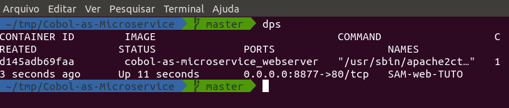
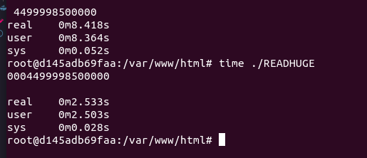

Repositório para demostrar como podemos utilizar o Cobol como um microserviço e comparativo de processamento com PHP

Para executar em sua máquina, clone o repositório

1. `git clone https://github.com/samhk222/Cobol-as-Microservice.git`
2. cd Cobol-as-Microservice
3. `docker network prune --force && docker stop $(docker ps -a -q) && docker-compose down && docker-compose build && docker-compose  up -d`
4.`docker ps` para ver os containers 
5. 
6. Nesse caso o ID do container rodando é o **d145adb69faa** então para acessá-lo `docker exec -it d145adb69faa /bin/bash`

Para fazer os testes:

PHP
---
`time php -f READHUGE.php`

Cobol
---
`time ./READHUGE`

